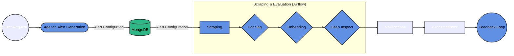
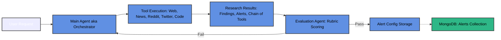
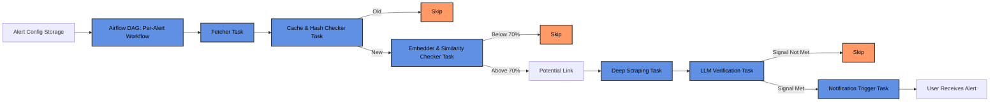

# Noteefy: Know More, Check Less!

## What is the Problem?
People want to stay informed about very specific things, like: “If there’s a war between X and Y,” or “When a new AI model drops,” or “Has the new Pope traveled yet?”
But:

- News apps and social media blast too much unrelated content.
- Subscribing to outlets means you get everything, not just what you care about.
- You have to keep checking, refreshing, digging—only to often be too late when it matters.

There’s no simple way to say:
***“Hey, just tell me when this one exact thing happens.”***
You either miss it or drown in noise trying to find it.


## What is the Solution? **Noteefy**
It’s a topic-triggered notification system powered by custom prompts. You subscribe to exactly what you want to hear about (from the entire internet), and you’ll get:
- A real-time ping when it happens, or
- A daily digest if you prefer low-noise updates.

You're not following sources. You're setting conditions.
It’s like saying:

***“Call me only when this happens.”***

And Noteefy does.

For example, instead of refreshing your news feed every 10 minutes hoping for **“AI model GPT-5 released”**
you just tell Noteefy:

***“Notify me when a new GPT model is announced.”***

Then go live your life, we’ve got your back.

---
# System Design

Noteefy delivers targeted, real-time alerts through a multi-phase workflow that combines AI, automation, and smart filtering. Here’s how the system works from start to finish:



## 1. Agentic Process (AI Orchestration)
This is the intelligence layer that turns your natural language request into a precise, actionable monitoring configuration. Here’s how it works in Noteefy:



- **User Request:** You describe what you want to be notified about, in plain language.
- **Main Agent (AI Orchestrator):** Receives your request and actually runs a research workflow using real tools (web search, news, Reddit, Twitter/X, code execution) to:
  - Understand the context and current status of your topic.
  - Discover all relevant entities, names, aliases, and organizations.
  - Identify the best sources (news, social, official) to monitor.
  - Analyze how similar events are typically announced.
- **Research Results:** The agent produces a detailed summary of findings, a chain of tools used, and a set of 3-5 alert configs (each with a monitorable URL, comprehensive indicators, clear signal, and frequency).
- **Evaluation Agent:** The research is scored using a rubric (number/diversity of alerts, URL quality, indicator coverage, signal clarity, research evidence, tool chaining). If it doesn’t pass, the agent gets feedback and tries again, up to 3 times.
- **Alert Config Storage:** Once the research passes, the embeddings for the indicators will be generated and the finalized alert configs are saved and the rest of the pipeline begins. The alert config documents looks like this:

```json
{
  "id": "12345678-1234-1234-1234-abcdefabcdef",
  "user_id": "12345678-1234-1234-1234-abcdefabcdef",
  "data": {
    "response": {
      "chain_of_tools": [
        "internet_search: 'Artemis mission current status'",
        "search_news: 'Artemis mission'",
        "search_reddit: 'Artemis mission'"
      ],
      "findings": "Summary of research findings and discovered entities, sources, and rationale.",
      "alerts": [
        {
          "url": "https://www.nasa.gov/artemis/",
          "indicators": [
            {"text": "Artemis", "embedding": [/* ...vector... */]},
            {"text": "Humans to Moon", "embedding": [/* ...vector... */]},
            {"text": "Lunar Mission", "embedding": [/* ...vector... */]}
          ],
          "signals": "if any indicator appears in headline or update",
          "frequency": "*/30 * * * *"
        }
      ]
    },
    "mode": "instant"
  },
  "created_at": "2025-07-19T11:00:24.360756",
  "metadata": {}
}
```


## 2. Scraping and Evaluation:
After the alert configuration is created, a dedicated Airflow DAG (workflow) is generated for each alert. Each DAG is scheduled according to the alert's frequency (hourly, daily, etc.) and orchestrates the following steps as independent, observable tasks:



- **Fetcher & Scheduler:** Airflow schedules and runs a fetch task for each alert at the specified interval, retrieving content from the alert's URLs or resources.
- **Cache & Hash Checker:** A task checks if the fetched content is new by comparing hashes or using a cache to avoid duplicate processing.
- **Filtering by Semantic Similarity:** Another task embeds the new content and compares it to the alert’s indicator embeddings. If similarity is above 70%, it proceeds.
- **Deep Scraping & LLM Verification:** If the content is relevant, a deep scrape task fetches the full content, and an LLM verification task checks if the content truly matches the alert’s signal.
- **Notification Trigger:** If the signal is met, the final task triggers a notification (e.g., via push, email, or another service).

**Note:** For using Airflow, you can check the [Airflow Instructions](/Users/behnvm/Documents/Noteefy/.github/instructions/airflow.instructions.md) for setup and usage details.

Each alert can have its own schedule, resources, and logic, and Airflow provides monitoring, retries, and dependency management for the entire workflow.

## 3. Notification & Feedbacks
This is where the system delivers the alert to you and learns from your interactions. System generates a notification and sends it to the Kafka consumer, which you will receive in your preferred channel (email, push, etc.). You can also mark alerts as relevant or not, which feeds back into the system to improve future accuracy. The system learns from your feedback, getting smarter and more personalized over time.

---
# Coding Guidelines

## Global language guidance
- Use Python 3.10+ syntax and features.
- Write Docstrings for all public functions and classes.
- Use type hints for function parameters and return types.
- Follow PEP 8 style guide for Python code.
- Use f-strings for string formatting.

## Service Structure
The backend is organized into services, each responsible for a specific domain or functionality. Each service should follow a consistent structure to ensure maintainability and clarity. Here’s the recommended structure:
- Each Service should have its own directory under (like `alerts`).
   - Each service directory should contain:
     - `__init__.py` for package initialization.
     - `service.py` for the main service logic.
     - `models.py` for data models.
     - `routes.py` for API routes.
     - `celery_tasks.py` for Celery tasks (if applicable).

**Note:** Each service is only one folder deep to keep the structure flat and easy to navigate. Avoid nesting services within subdirectories unless absolutely necessary.

**Note:** The `backend/` directory is the root for all backend services. Each service should be self-contained and follow the same structure to ensure consistency across the codebase.

**Note:** Put commonly used utility functions in the `utils/` directory, which can be imported by any service as needed.

## Repository Structure
The repository is structured to separate concerns and facilitate development. Here’s the high-level structure:
- `backend/` - Contains the backend services.
  - `auth/` - Service for user authentication and authorization.
  - `alerts/` - Service for managing alerts.
  - `db/` - Database models and migrations.
  - `utils/` - Utility functions and helpers.
  - `main.py` - Entry point for the backend application.
  - `rate_limiter.py` - Rate limiting middleware.
  - `celery_app.py` - Celery application setup.

**Note:** When asked to add a new service, create a new directory under `backend/` with the same structure as the existing services. Ensure that the new service is self-contained and follows the same conventions.